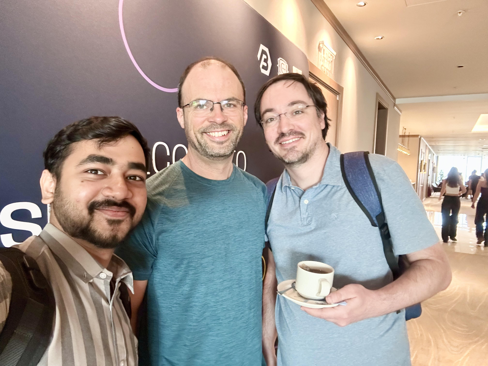
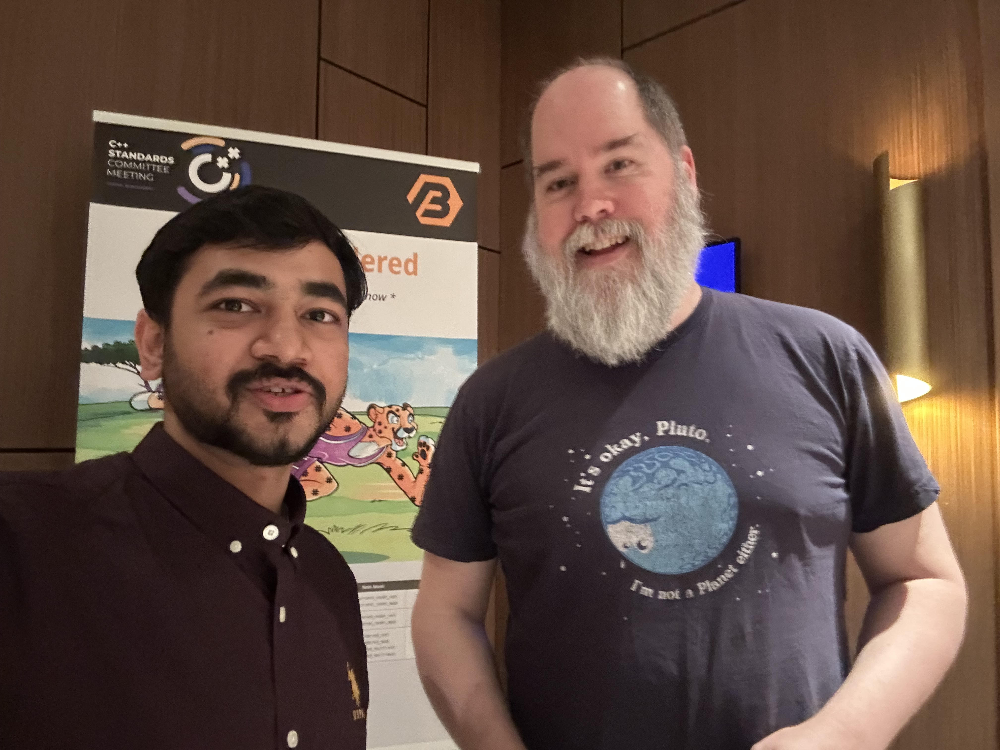

# Nvidia 2025-06 ISO C++ WG21 Committee Meeting Trip Report

ISO C++ Standardization Meeting for C++ 26 conlcuded last week at [Sofia, Bulgaria](https://wg21.link/n5004). This was the final meeting for adding both core and library features to C++ 26 working draft. In general, the single most significant addition to the core was ```Reflection```  and this will change how we write C++ at a fundamental level. There were 34 paper additions to the standard Library - keeping aside 10 paper additions to Core , 5 of which were `reflection` papers. One of those 34 Library papers included my co-authored paper.

## Reflection

Reflection is perhaps the most significant feature voted into the standards since C++ 11 `constexpr`. Reflection in C++ refers to the ability of a program to examine, introspect, and potentially modify its own structure and behavior at compile time or runtime. C++ did infact support some subtle variants of "reflective metaprogramming" through `RTTI: Runtime Type Information` (through `typeid` operator and `std::type_info` construct) and sometimes through `Template Metaprogramming`(Compile time Metagprogramming).
[P1240R2](https://www.open-std.org/jtc1/sc22/wg21/docs/papers/2022/p1240r2.pdf) was an early paper to introduce the notion of static reflections in C++ with the reflection TS mainly introducing the `^` operator which can be used as :
```
constexpr std::meta::info reflection = ^name_or_postfix_expr;
```
This paved the way for [P2996R12](https://www.open-std.org/jtc1/sc22/wg21/docs/papers/2025/p2996r12.html) by Dan Katz et al, which introduced the following additional featues

- The representation of program elements via constant-expressions producing reflection values — reflections for short — of an opaque type `std::meta::info`
- A `reflection operator` (prefix ^^) that computes a reflection value for its operand construct
- A number of consteval metafunctions to work with reflections (including deriving other reflections)
- Constructs called splicers to produce grammatical elements from reflections (e.g., ``[: refl :]``).

A practical example of reflection is converting enums to string :

```
template<typename E, bool Enumerable = std::meta::is_enumerable_type(^^E)>
  requires std::is_enum_v<E>
constexpr std::string_view enum_to_string(E value) {
  if constexpr (Enumerable)
    template for (constexpr auto e :
                  std::define_static_array(std::meta::enumerators_of(^^E)))
      if (value == [:e:])
        return std::meta::identifier_of(e);

  return "<unnamed>";
}

int main() {
  enum Color : int;
  static_assert(enum_to_string(Color(0)) == "<unnamed>");
  std::println("Color 0: {}", enum_to_string(Color(0)));  // prints '<unnamed>'

  enum Color : int { red, green, blue };
  static_assert(enum_to_string(Color::red) == "red");
  static_assert(enum_to_string(Color(42)) == "<unnamed>");
  std::println("Color 0: {}", enum_to_string(Color(0)));  // prints 'red'
}
```

The paper has some [concrete examples](https://www.open-std.org/jtc1/sc22/wg21/docs/papers/2025/p2996r12.html#examples) as to the capabilities of runtime type transfers, serialization, getting the class layouts and other enhancements which were not possible before. In Sofia, there were 6 reflection papers (including the above) with  5 of those dedicated to Core and 1 for Library feature. The below contains the summarizations of the papers taken from Herb's Blog:

- [P3394R4](https://wg21.link/p3394) adds the ability to reflect additional attribute information, which makes reflection much more customizable and flexible. Definitely check out the examples in the paper.

- [P3293R3](https://wg21.link/p3293) adds better support for treating base class subobjects uniformly with member subobjects, again making reflection more usable.

- [P3491R3](https://wg21.link/p3491)adds functions that were split off from the main reflection paper P2996, which make it easier to convert reflected data to run-time data.

- [P1306R5](https://wg21.link/p1306) adds “template for” to make it easy to loop over reflection data at compile time.

- [P3096R12](https://wg21.link/p3096) adds library  support for, you guessed it, reflecting function parameters. 

Reflection is something which was long due for C++ and this will fundamentally change the way compilers and formal language interpreters are written. 

## Papers presented and added to C++ 26 Working Draft
 
I was at the Standards Meeting in person and had co-authored two proposals for ```std::simd``` and ```std::ranges```. My focus was on library additions of ```simd```, ```bit``` and ```execution``` (parallel algorithms) features which would benefit much of the cpu backend interface with ```C++``` and solve critical problems in concurrent systems and parallel programming.
There were several proposals in ```simd``` including the major change to have its own namespace which included all library extensions. 

### [P3691 Rename std::simd namespace](https://wg21.link/P3691)

*Nvidia Authors: Bryce Lelbach, Mark Hoemmen, Ilya Burylov, Abhilash Majumder*

The idea of putting ```std::simd``` components in their own namespace, instead of in namespace std, came late in the design process.  The new namespace was originally std::simd.  Objections to the namespace being the same as the class (`std::simd::simd`) led to the namespace being changed from `std::simd` to `std::datapar` (as in, “data-parallel types and functions”).  Library Evolution Group decided to rename the namespace back from `std::datapar` to `std::simd`. The changes makes it easier for users to see that these types relate to the SIMD (Single Instruction, Multiple Data) computer hardware feature.  It also avoids redundancy in names and distinguishes a SIMD register of values (“`vec`”) from other SIMD features like bit masks.
Here is an image with co-author Matthias Kretz and LWG member Christian Trott.




### [P3732R0 Numeric Range Algorithms](https://isocpp.org/files/papers/P3732R0.html)

*Nvidia Authors: Bryce Lelbach, Mark Hoemmen, Abhilash Majumder*


This objective of this paper is to add `parallel` ranges support for `numeric algorithms`. [Numeric algorithms](https://eel.is/c++draft/numeric.ops) were the terminal algorithms to be made `constexpr` and there has been a significant delay in enabling parallel support for these algorithms. Mainly from parallelization point of view, this library feature would make interfacing with algorithms such as `std::reduce` with `ranges` and execution policies possible which would inturn enhance applications such as `BLAS` , `thrust` to a large extent. This is a complex paper requiring consensus from 2 C++ subgroups - `SG1 : Concurrency and Parallelism` and `SG9 : Ranges` before its admission to Library Evolution Working Group and eventually to Library. 
 
 #### A brief overview of the design discussions and consensus from SG1 : 
 SG1 agrees that users should have a way to specify identity values, though further investigation is needed to determine whether compile-time specification is necessary or if a runtime-only interface would suffice, given concerns about the performance cost of broadcasting identity values versus using compile-time known values. The group also requests adding reduce_into and transform_reduce_into functions that write reduction results to an output range, addressing user complaints about being unable to write results to device memory and enabling in-place reduction into struct members or variables. While SG1 has no objections to adding transform_* algorithms, they request separate proposals for fixing movable-box trivial copyability and general performance issues with views, with Bryce Lelbach specifically advocating for more relaxed wording to enable parallelization around operations like filters.  
 
#### A brief overview of design discussions and consensus from SG9 : 
Since our proposal also has requirements from `SG9: Ranges` from consensus point of view, Bryce and myself had an offline brainstorming discussion with Zach Laine, and later with Jonathon Muller (SG9 chairs) regarding the design discussion and approaches. The finalized review was that the numeric algorithms should not break ABI changes introduced by parallel algorithms , and also if `projections` are needed to be used. With projections, binary `transform_reduce` would have four function arguments in a row although `fold_*` algorithms do not take projections. There were some additional discussions in terms of return type for a size-1 range, and do we need `sized` or ` forward` ranges or both. On a broader level, the design looked reasonable to the reviewers. 

This would eventually be taken up in the next ISO C++ WG21 meeting at US. 

Here is me, delighted after the discussion with Zach 




## Nvidia's proposals 

There were proposals by my colleagues on different parts of the Standard Library . Here are some of them which have a profound impact on the language operability. 

- [P3481R4 std::execution::bulk() issues](https://isocpp.org/files/papers/P3481R4.html)
 *Nvidia Authors: Mark Hoemmen, Bryce Lelbach*
The paper outlines what  is permissible in the customization of `bulk()` and also to resolve the lack of an execution policy for the provided functor . The paper also addresses the absence of chunking in the default implementation of `bulk()`. This proposal also adds `bulk_chunked` and `bulk_unchunked` in addition to `bulk()`. Proposal is accepted in the C++ 26 working draft.

- [P3111R6 Atomic Reduction Operations](https://www.open-std.org/jtc1/sc22/wg21/docs/papers/2025/p3111r6.html)
*Nvidia Authors: Gonzalo Brito, Simon Cooksey, Dan Lustig*
This paper outlines Atomic Reduction Operations which are `read-modify-write` operations that don't fetch old values or act as reads for synchronization, enabling hardware acceleration on modern CPUs and GPUs. The proposal allows atomic memory operations that aren't reads to be used in unsequenced execution contexts.
It also extends atomic arithmetic reductions for floating-point types by assuming floating-point arithmetic is associative. Proposal is accepted in the C++ 26 working draft.

- [P3008R5 Atomic floating point min/max](https://www.open-std.org/jtc1/sc22/wg21/docs/papers/2025/p3008r5.html)
*Nvidia Authors: Gonzalo Brito*
This paper addresses discrepancies in a pre-existing paper related to `atomic<T>::fetch_min/max` on contemporary hardwares and IEEE standards. Also discusses the results from `C (fmin/fmax)`, `C23 (maximum/minimum)` along with hardware atomic floating point apis such as `atom, red` for `PTX` , `AOP_FMIN/FMAX` for `Intel Xe ISA` which adhere to IEEE-2019 compat standards. Proposal is accepted in C++ 26 working draft.

- [P3718R0 Fixing Lazy Sender Algorithm Customization, Again](https://isocpp.org/files/papers/P3718R0.html)
*Nvidia Authors: Eric Niebler*
The Standard does not currently specify the semantics of `get_scheduler(get_env(rcvr))`.  This is defined as the “current scheduler,” but the Standard does not impose requirements on algorithms actually to execute / start / complete operations on the “current scheduler.”  The definition of `get_scheduler()` does not define any semantics, only mechanics. This paper proposes to fix this by requiring that operation states are started on the scheduler of the receiver’s environment.A previous paper introducing late customization contained an error where the customization logic for `continues_on` and `schedule_from` was inadvertently reversed. This paper corrects that mistake and is added in the C++ 26 working draft.


## Library Working Group Features for C++ 26