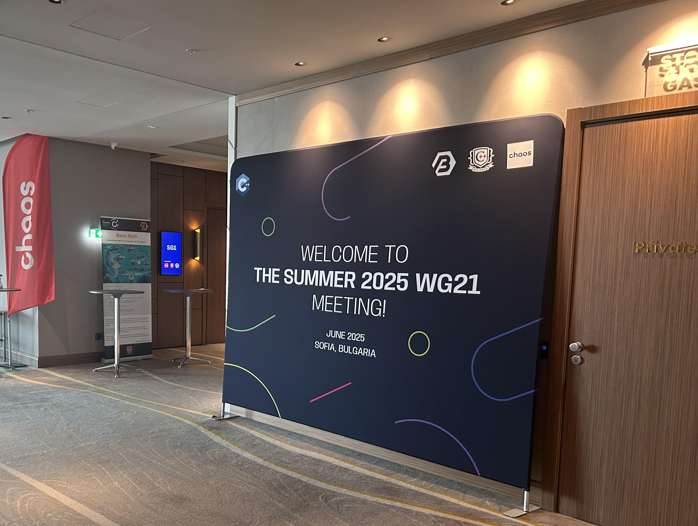

# Nvidia 2025-06 ISO C++ WG21 Committee Meeting Trip Report

(Abhilash Majumder, Nvidia)


ISO C++ Standardization Meeting for C++ 26 conlcuded last week at [Sofia, Bulgaria](https://wg21.link/n5004). This was the final meeting for adding both core and library features to C++ 26 working draft. In general, the single most significant addition to the core was ```Reflection```  and this will change how we write C++ at a fundamental level. There were 34 paper additions to the standard Library - keeping aside 10 paper additions to Core , 5 of which were `reflection` papers. One of those 34 Library papers included my co-authored paper.




The six-day (16th - 21st June) C++ standards meeting was hosted by Chaos and C++ Alliance at the Grand Millenium (Sofia) with about 200 attendees (two-thirds in-person, one-third remote via Zoom) representing nearly 30 nations. The meeting welcomed 25 new first-time guest attendees (mostly in-person) plus additional new official national body representatives. The sessions started off with the initial Plenary guidelines on 16th and ended with the final Plenary voting polls for Core and Library at 21st.

## Reflection

Reflection is perhaps the most significant feature voted into the standards since C++ 11 `constexpr`. Reflection in C++ refers to the ability of a program to examine, introspect, and potentially modify its own structure and behavior at compile time or runtime. C++ did infact support some subtle variants of "reflective metaprogramming" through `RTTI: Runtime Type Information` (through `typeid` operator and `std::type_info` construct) and sometimes through `Template Metaprogramming`(Compile time Metagprogramming).
[P1240R2](https://www.open-std.org/jtc1/sc22/wg21/docs/papers/2022/p1240r2.pdf) was an early paper to introduce the notion of static reflections in C++ with the reflection TS mainly introducing the `^` operator which can be used as :
```
constexpr std::meta::info reflection = ^name_or_postfix_expr;
```
This paved the way for [P2996R12](https://www.open-std.org/jtc1/sc22/wg21/docs/papers/2025/p2996r12.html) by Dan Katz et al, which introduced the following additional featues

- The representation of program elements via constant-expressions producing reflection values — reflections for short — of an opaque type `std::meta::info`
- A `reflection operator` (prefix ^^) that computes a reflection value for its operand construct
- A number of consteval metafunctions to work with reflections (including deriving other reflections)
- Constructs called splicers to produce grammatical elements from reflections (e.g., ``[: refl :]``).

A practical example of reflection is converting enums to string :

```
template<typename E, bool Enumerable = std::meta::is_enumerable_type(^^E)>
  requires std::is_enum_v<E>
constexpr std::string_view enum_to_string(E value) {
  if constexpr (Enumerable)
    template for (constexpr auto e :
                  std::define_static_array(std::meta::enumerators_of(^^E)))
      if (value == [:e:])
        return std::meta::identifier_of(e);

  return "<unnamed>";
}

int main() {
  enum Color : int;
  static_assert(enum_to_string(Color(0)) == "<unnamed>");
  std::println("Color 0: {}", enum_to_string(Color(0)));  // prints '<unnamed>'

  enum Color : int { red, green, blue };
  static_assert(enum_to_string(Color::red) == "red");
  static_assert(enum_to_string(Color(42)) == "<unnamed>");
  std::println("Color 0: {}", enum_to_string(Color(0)));  // prints 'red'
}
```

The paper has some [concrete examples](https://www.open-std.org/jtc1/sc22/wg21/docs/papers/2025/p2996r12.html#examples) as to the capabilities of runtime type transfers, serialization, getting the class layouts and other enhancements which were not possible before. In Sofia, there were 6 reflection papers (including the above) with  5 of those dedicated to Core and 1 for Library feature. The below contains the summarizations of the papers taken from Herb's Blog:

- [P3394R4](https://wg21.link/p3394) adds the ability to reflect additional attribute information, which makes reflection much more customizable and flexible. Definitely check out the examples in the paper.

- [P3293R3](https://wg21.link/p3293) adds better support for treating base class subobjects uniformly with member subobjects, again making reflection more usable.

- [P3491R3](https://wg21.link/p3491)adds functions that were split off from the main reflection paper P2996, which make it easier to convert reflected data to run-time data.

- [P1306R5](https://wg21.link/p1306) adds “template for” to make it easy to loop over reflection data at compile time.

- [P3096R12](https://wg21.link/p3096) adds library  support for, you guessed it, reflecting function parameters. 

Reflection is something which was long due for C++ and this will fundamentally change the way compilers and formal language interpreters are written. 

## Papers presented and added to C++ 26 Working Draft
 
I was at the Standards Meeting in person and had co-authored two proposals for ```std::simd``` and ```std::ranges```. My focus was on library additions of ```simd```, ```bit``` and ```execution``` (parallel algorithms) features which would benefit much of the cpu backend interface with ```C++``` and solve critical problems in concurrent systems and parallel programming.
There were several proposals in ```simd``` including the major change to have its own namespace which included all library extensions. 

### [P3691 Rename std::simd namespace](https://wg21.link/P3691)

*Nvidia Authors: Bryce Lelbach, Mark Hoemmen, Ilya Burylov, Abhilash Majumder*

The idea of putting ```std::simd``` components in their own namespace, instead of in namespace std, came late in the design process.  The new namespace was originally std::simd.  Objections to the namespace being the same as the class (`std::simd::simd`) led to the namespace being changed from `std::simd` to `std::datapar` (as in, “data-parallel types and functions”).  Library Evolution Group decided to rename the namespace back from `std::datapar` to `std::simd`. The changes makes it easier for users to see that these types relate to the SIMD (Single Instruction, Multiple Data) computer hardware feature.  It also avoids redundancy in names and distinguishes a SIMD register of values (“`vec`”) from other SIMD features like bit masks.
Here is an image with co-author Matthias Kretz and LWG member Christian Trott.


### [P3732R0 Numeric Range Algorithms](https://isocpp.org/files/papers/P3732R0.html)

*Nvidia Authors: Bryce Lelbach, Mark Hoemmen, Abhilash Majumder*


This objective of this paper is to add `parallel` ranges support for `numeric algorithms`. [Numeric algorithms](https://eel.is/c++draft/numeric.ops) were the terminal algorithms to be made `constexpr` and there has been a significant delay in enabling parallel support for these algorithms. Mainly from parallelization point of view, this library feature would make interfacing with algorithms such as `std::reduce` with `ranges` and execution policies possible which would inturn enhance applications such as `BLAS` , `thrust` to a large extent. This is a complex paper requiring consensus from 2 C++ subgroups - `SG1 : Concurrency and Parallelism` and `SG9 : Ranges` before its admission to Library Evolution Working Group and eventually to Library. 
 
 #### A brief overview of the design discussions and consensus from SG1 : 
 SG1 agrees that users should have a way to specify identity values, though further investigation is needed to determine whether compile-time specification is necessary or if a runtime-only interface would suffice, given concerns about the performance cost of broadcasting identity values versus using compile-time known values. The group also requests adding reduce_into and transform_reduce_into functions that write reduction results to an output range, addressing user complaints about being unable to write results to device memory and enabling in-place reduction into struct members or variables. While SG1 has no objections to adding transform_* algorithms, they request separate proposals for fixing movable-box trivial copyability and general performance issues with views, with Bryce Lelbach specifically advocating for more relaxed wording to enable parallelization around operations like filters.  
 
#### A brief overview of design discussions and consensus from SG9 : 
Since our proposal also has requirements from `SG9: Ranges` from consensus point of view, Bryce and myself had an offline brainstorming discussion with Zach Laine, and later with Jonathon Muller (SG9 chairs) regarding the design discussion and approaches. The finalized review was that the numeric algorithms should not break ABI changes introduced by parallel algorithms , and also if `projections` are needed to be used. With projections, binary `transform_reduce` would have four function arguments in a row although `fold_*` algorithms do not take projections. There were some additional discussions in terms of return type for a size-1 range, and do we need `sized` or ` forward` ranges or both. On a broader level, the design looked reasonable to the reviewers. 

This would eventually be taken up in the next ISO C++ WG21 meeting at US. 

Here is me, delighted after the discussion with Zach 


## Nvidia's proposals 

There were proposals by my colleagues on different parts of the Standard Library . Here are some of them which have a profound impact on the language operability. 

[P3481R4 std::execution::bulk() issues](https://isocpp.org/files/papers/P3481R4.html)
 *Nvidia Authors: Mark Hoemmen, Bryce Lelbach*
The paper outlines what  is permissible in the customization of `bulk()` and also to resolve the lack of an execution policy for the provided functor . The paper also addresses the absence of chunking in the default implementation of `bulk()`. This proposal also adds `bulk_chunked` and `bulk_unchunked` in addition to `bulk()`. This paper allows to extend a thin wrapper on top of `bulk / bulk_chunked / bulk_unchunked` on the user side that calls the algorithm with the execution policy of choice. Something like:
```
auto user_bulk_par(auto prev, auto size, auto f) {
  return std::execution::bulk(std::execution::par, prev, size, f);
}
```
Proposal is accepted in the C++ 26 working draft.

[P3111R6 Atomic Reduction Operations](https://www.open-std.org/jtc1/sc22/wg21/docs/papers/2025/p3111r6.html)
*Nvidia Authors: Gonzalo Brito, Simon Cooksey, Dan Lustig*
This paper outlines Atomic Reduction Operations which are `read-modify-write` operations that don't fetch old values or act as reads for synchronization, enabling hardware acceleration on modern CPUs and GPUs. The proposal allows atomic memory operations that aren't reads to be used in unsequenced execution contexts.
It also extends atomic arithmetic reductions for floating-point types by assuming floating-point arithmetic is associative. 
A sample snippet using `fetch_add` taken from the paper which gives Undefined Behaviour and is slow:
```cpp
#include <algorithm>
#include <atomic>
#include <execution>
using namespace std;
using execution::par_unseq;

int main() {
  size_t N = 10000;
  vector<int> v(N, 0);
  atomic<int> atom = 0;
  for_each_n(par_unseq, 
     v.begin(), N,
    [&](auto& e) {
      // UB+SLOW:
      atom.fetch_add(e);
  }); 
  return atom.load();
}
```
With this proposal of `store_add` here is the updated code which is safe and fast:

```cpp
#include <algorithm>
#include <atomic>
#include <execution>
using namespace std;
using execution::par_unseq;

int main() {
  size_t N = 10000;
  vector<int> v(N, 0);
  atomic<int> atom = 0;
  for_each_n(par_unseq, 
     v.begin(), N,
    [&](auto& e) {
      // OK+FAST
      atom.store_add(e);
  }); 
  return atom.load();
}     
```
Proposal is accepted in the C++ 26 working draft.

[P3008R5 Atomic floating point min/max](https://www.open-std.org/jtc1/sc22/wg21/docs/papers/2025/p3008r5.html)
*Nvidia Authors: Gonzalo Brito*
This paper addresses discrepancies in a pre-existing paper related to `atomic<T>::fetch_min/max` on contemporary hardwares and IEEE standards. Also discusses the results from `C (fmin/fmax)`, `C23 (maximum/minimum)` along with hardware atomic floating point apis such as `atom, red` for `PTX` , `AOP_FMIN/FMAX` for `Intel Xe ISA` which adhere to IEEE-2019 compat standards. Proposal is accepted in C++ 26 working draft.

[P3718R0 Fixing Lazy Sender Algorithm Customization, Again](https://isocpp.org/files/papers/P3718R0.html)
*Nvidia Authors: Eric Niebler*
The Standard does not currently specify the semantics of `get_scheduler(get_env(rcvr))`.  This is defined as the “current scheduler,” but the Standard does not impose requirements on algorithms actually to execute / start / complete operations on the “current scheduler.”  The definition of `get_scheduler()` does not define any semantics, only mechanics. This paper proposes to fix this by requiring that operation states are started on the scheduler of the receiver’s environment.A previous paper introducing late customization contained an error where the customization logic for `continues_on` and `schedule_from` was inadvertently reversed. This paper corrects that mistake and is added in the C++ 26 working draft.

[P3557R2 High Quality Sender Diagnostics with Constexpr Exceptions](https://www.open-std.org/jtc1/sc22/wg21/docs/papers/2025/p3557r2.html)
*Nvidia Authors: Eric Niebler*
This paper proposes leveraging C++26's new support for exceptions during constant-evaluation to improve error reporting in sender algorithms. Since computing completion signatures is complex meta-programming that often produces incomprehensible error messages deep within the meta-program, the proposal uses constant-evaluation exceptions to automatically propagate type errors to the API boundary where they can be reported concisely. This approach significantly improves user diagnostics while simplifying the development of new sender algorithms by providing clearer error propagation similar to how runtime exceptions work for runtime errors.

[P3655R2 std::zstring_view](https://isocpp.org/files/papers/P3655R2.html)
*Nvidia Authors: Marco Foco*
`std::string_view` is highly useful but not null-terminated, making it unsuitable for C++ APIs, operating system calls, and other interfaces requiring null-terminated strings.
This forces developers to use the bug-prone `std::string_view::data()` approach or create custom null-terminated string view types like `zstring_view.`The proposal aims to standardize a null-terminated string view utility to address this common need safely. 

## Library Working Group Features for C++ 26

As I was fully focused on Library additions specifically for parallelism and SIMD, here are a few of the 34 accepted proposals discussed in detail:

[P3179R9 Parallel Range Algorithms](https://wg21.link/p3179)
This paper is very close to me as it was a paper I was working intermittently with my ex- Intel colleague Ruslan Arutyunyan and it has paved the way for our paper on numeric algorithms. The proposal adds parallel algorithms to be used with `std::ranges` library. This opens a wide range of possibilities of interfacing different execution policies which can be used with parallel algorithms and ranges. Below is a matrix transpose program without this feature:
```cpp
std::mdspan A{input,  N, M};
std::mdspan B{output, M, N};

auto indices = std::views::cartesian_product(
  std::views::iota(0, A.extent(0)),
  std::views::iota(0, A.extent(1)));

std::for_each(std::execution::par_unseq,
  std::ranges::begin(indices),
  std::ranges::end(indices),
  [=] (auto idx) {
    auto [i, j] = idx;
    B[j, i] = A[i, j];
  });
```
With the newly introduced parallel support for ranges, this can be written as :
```cpp
std::mdspan A{input,  N, M};
std::mdspan B{output, M, N};

std::ranges::for_each(std::execution::par_unseq,
  std::views::cartesian_product(
    std::views::iota(0, A.extent(0)),
    std::views::iota(0, A.extent(1))),
  [=] (auto idx) {
    auto [i, j] = idx;
    B[j, i] = A[i, j];
  });
```


[P3709 Reconsider parallel_ranges::rotate_copy and reverse_copy](https://wg21.link/P3709)
This is an extension of the previous paper. Library Evolution Working Group approved the "range-as-the-output" design for parallel range algorithms, where algorithms return past-the-last iterator for input when output size is insufficient (e.g., `std::ranges::copy` returns `input.begin() + 3` when copying only 3 elements). While this works well for simple algorithms, it creates consistency problems for `reverse_copy` and `rotate_copy` because these algorithms traverse input differently—`reverse_copy` goes in reverse and `rotate_copy` splits ranges, meaning past-the-last iterator is never actually the end iterator even with sufficient output size. The design challenge is that serial range algorithms always return last for these operations, but parallel versions would return different iterators even when output size is sufficient, creating inconsistency. Since future serial "range-as-the-output" algorithms may need to return both stop point and last iterator information, parallel algorithms need to be designed to return more information for random access iterators to maintain consistency between serial and parallel versions.The proposal recognizes that `reverse_copy` and `rotate_copy` need special handling despite the goal of keeping the same return types as existing range algorithms.

[P2079R8 Parallel Scheduler](https://www.open-std.org/jtc1/sc22/wg21/docs/papers/2025/p2079r8.html)
This proposal provides a standard async execution context that portably guarantees forward progress, aka an interface for thread pools. While the senders/receivers framework provides solid asynchronous primitives, it lacks a standard execution context and scheduler, which has been recognized as essential for practical use.The previous `static_thread_pool` approach was removed due to CPU oversubscription issues when multiple independent components create their own thread pools, causing performance problems in complex systems. System context addresses these issues by providing a unified execution foundation that enables different application components to work together without interfering with each other's parallel engines. As a simple parallel scheduler we can use it locally, and `sync_wait` on the work to make sure that it is complete. With forward progress delegation this would also allow the scheduler to delegate work to the blocked thread. A simple "Hello World" program with the `parallel_scheduler` is shown below:

```cpp
using namespace = std::execution;

scheduler auto sch = get_parallel_scheduler();

sender auto begin = schedule(sch);
sender auto hi = then(begin, []{
    std::cout << "Hello world! Have an int.";
    return 13;
});
sender auto add_42 = then(hi, [](int arg) { return arg + 42; });

auto [i] = std::this_thread::sync_wait(add_42).value();
```
This also gives us leverage to customize `bulk()` and `async_scope`.

[P3149R10 async_scope - Creating scope for asynchronous concurrency](https://www.open-std.org/jtc1/sc22/wg21/docs/papers/2025/p3149r10.html) 
This proposal is about enabling RAII styles to work in code that isn’t sequential and stack-based, which makes resource handling much more convenient and robust even in a heavily async world using sender/receiver, C++ 26’s new async model. The existing structured concurrency framework provides groundwork for concurrent C++ programs but leaves three important scenarios unaddressed: progressively structuring existing unstructured concurrent programs, starting dynamic numbers of parallel tasks without losing track of them, and opting into eager execution when appropriate.
The proposed utilities address these scenarios within two key constraints:

- No detached work by default: Algorithms like `start_detached` and `ensure_started` allow concurrent work to start without built-in completion tracking, making it difficult to know when it's safe to destroy resources. All concurrent work should remain "attached" to avoid shutdown complexity.

- No additional dependencies: Since existing codebases need to migrate incrementally from unstructured to structured concurrency, the tools for progressive restructuring shouldn't introduce unnecessary dependencies or risks. This also serves as a teaching aid to help experienced C++ programmers unlearn deprecated async patterns and avoid falling back to detached work habits.

[P2664R10 Extend std::simd with permutation API](https://www.open-std.org/jtc1/sc22/wg21/docs/papers/2025/p2664r10.html)
This paper proposes adding permutation API functions to the std::simd proposal to enable element permutation across or within SIMD values. While the current std::simd proposal from the Parallelism TS lacks robust support for permutation operations, these capabilities are critical for data formatting tasks like transpose, strided operations, and interleaving, and are well-supported by modern SIMD processors' sophisticated permutation instructions. The proposal aims to make these underlying hardware instructions accessible through a generic API interface, building on Intel's suggestions for extending std::simd beyond the existing proposal.

[P2876R2 Extend std::simd with more constructors and accessors](https://www.open-std.org/jtc1/sc22/wg21/docs/papers/2025/p2876r2.html)
This paper proposes extending `std::simd_mask` with additional constructors and accessors to enable easier conversion between `std::simd_mask` and other standard library types like `std::bitset` and integral bit representations.

- Bitset Integration:
The paper proposes bidirectional conversion between `std::simd_mask` and `std::bitset`:

```cpp
// Constructor from bitset
constexpr basic_simd_mask(const bitset<size()>& b) noexcept;

// Conversion to bitset (implicit)
constexpr basic_simd_mask::operator bitset<size()>() const;

// Named conversion to bitset (explicit)
constexpr bitset<size()> basic_simd_mask::to_bitset() const;
```

- Integral Bit Representation:
For compact bit patterns, the proposal adds:

```cpp
// Constructor from integral bits
constexpr basic_simd_mask(auto unsigned_integral bits) noexcept;

// Example usage for custom bit patterns
basic_simd_mask mask(0b10101101011010010101);

// Conversion to compact bit representation
constexpr unsigned long long basic_simd_mask::to_ullong() const noexcept;
```
The current `std::simd` proposal lacks easy ways to convert between `simd_mask` and other data-parallel storage types. These additions enable efficient interchange with `std::bitset`, direct specification of bit patterns using integral values, and extraction of compact bit representations. The implementation experience shows these conversions are efficient on hardware with compact mask representations (like AVX-512) and provide uniform APIs for targets with wide mask representations. The paper originally included initializer list support but removed it in favor of existing CTAD and range/span constructors that achieve similar functionality with slightly more verbose syntax.

[P3480R5 std::simd is a range](https://www.open-std.org/jtc1/sc22/wg21/docs/papers/2025/p3480r5.pdf)
The paper proposes making `basic_simd` and `basic_simd_mask` into read-only ranges, leveraging C++ 20's updated iterator concepts. Previously, C++ 17 iterator categories required `operator*` to return lvalue references, but since SIMD objects don't contain sub-objects, their `operator[]` returns prvalues, limiting iterators to `Cpp17InputIterator` category despite having random access behavior. This created a conceptual mismatch that prevented making SIMD types into ranges in the original Parallelism TS 2. With C++20's iterator concepts no longer requiring lvalue references, SIMD types can now be proper read-only ranges where iterator dereference returns prvalues and sentinels provide useful abstraction tools.


## Papers of Special Interest

Since it not possible to cover the entirety of all the papers discussed and debated on, here are some exclusive papers which requires mention:

[P2830 Standardized Constexpr Type Ordering](https://wg21.link/p2830) 
This paper makes it possible for portable C++ code to sort types at compile time.

[P3552R2 Add a Coroutine Task Type](https://www.open-std.org/jtc1/sc22/wg21/docs/papers/2025/p3552r2.pdf)
This paper provides a task type to integrate coroutines with sender/receiver, C++26’s new async model.

[P3682 Remove std::execution::split](https://www.open-std.org/jtc1/sc22/wg21/docs/papers/2025/p3682r0.pdf)
This paper corrects a previous paper's erroneous description of `std::execution::split`, clarifying that it creates a multi-shot sender with shared state for both single-shot and multi-shot inputs rather than acting as identity for multi-shot senders. Following SG1's removal of `std::execution::split`, Rob Leahy and Bryce Lelbach proposed a `fork` alternative that returns a fork state object vending senders via `get_sender()` with specified cardinality for truly lazy execution, addressing split's problematic eager nature for CUDA graph schedulers.

[P3383R2 mdspan.at()](https://www.open-std.org/jtc1/sc22/wg21/docs/papers/2025/p3383r2.html)
This paper proposes adding `at()` member functions to `std::mdspan` for memory-safe element access with bounds checking that throws `std::out_of_range` on out-of-bounds access, providing consistency with `std::span` and other containers.

And that completes the technical aspects of this meeting, which is a significant milestone in C++ 's history. 

The next section contains photos which I managed to take in between the discussions. 

## Say Cheese!


Here is a picture with my colleagues - Bryce Lelbach, Gonzalo Brito and Marco Foco.


And here are some pictures capturing the beautiful city of Sofia.


Alexander Nevsky Cathedral 


Bell Tower


Vitosha Boulevard


City Garden


National Palace of Culture


Sveti Sedmochislenitsi Church


And for those passionate about cars , here is a P720 s Mclaren spotted at Doha Airport along with a Ducati Diavel 1200s


## Conclusion

The WG21 meeting in Sofia has been well received particularly from Nvidia's point of view with both core and library adding new features. The next meeting will start off from the papers which will be debated and discussed for C++ 29. 

